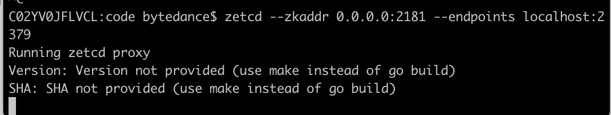
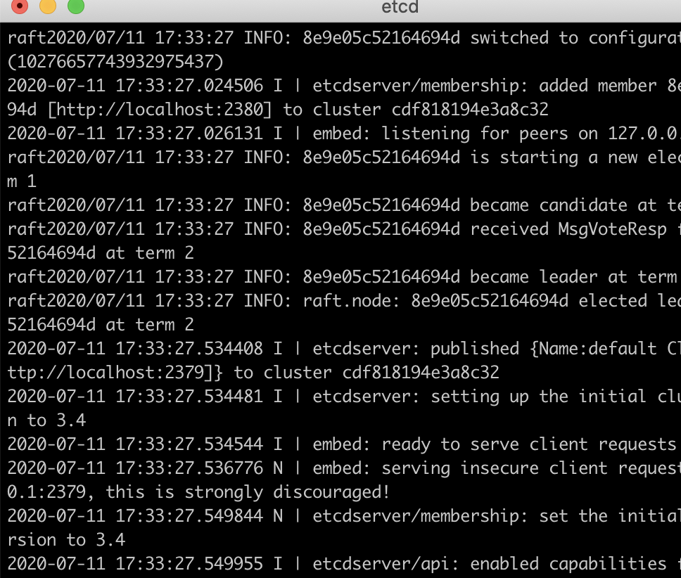
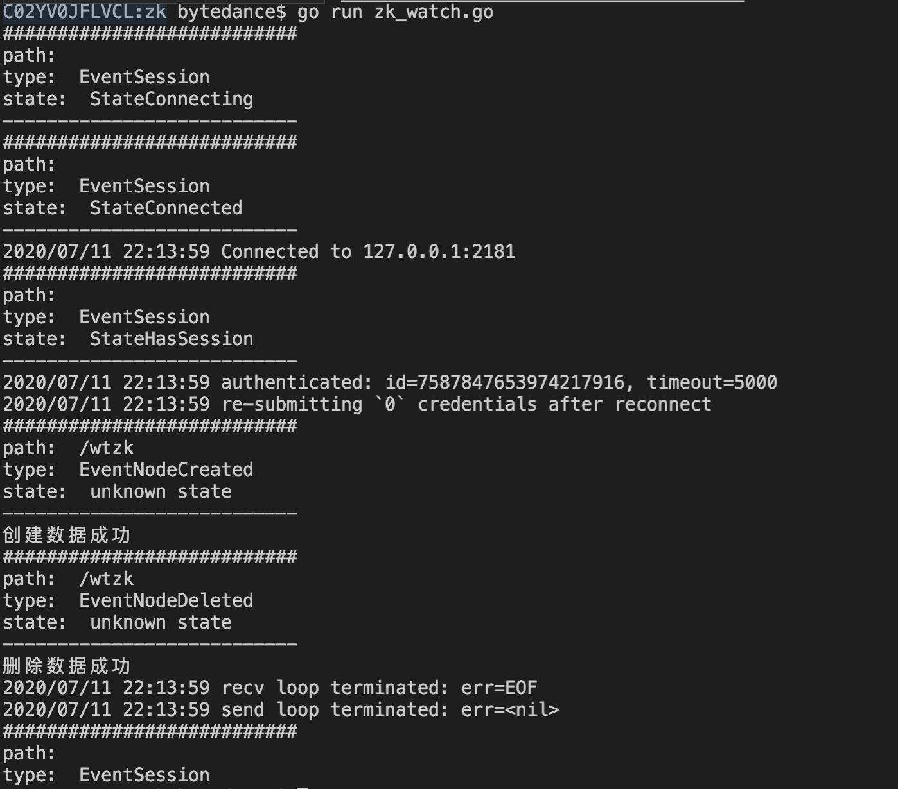
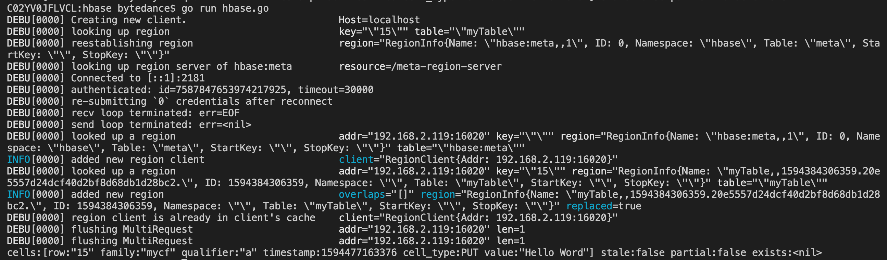

# Week 2 - 用zetcd适配go-hbase


## 适配原生zk

由于这周的任务是要完全骗过hbase里的zk 客户端，我个人认为zetcd已经能非常好的解决问题了，于是决定要用一个例子来证明。


既然要用zetcd 来代替原生 zk 集群，首先需要配置好zetcd, etcd的环境。etcd的环境非常容易，下载release之后export到环境变量。zetcd比较好的方式是go get。


配置好之后启动zetcd，etcd。并把zetcd的请求forward到zetcd上。

Zetcd:




Etcd:




先确认能否满足go-zookeeper的访问：

```go
package main


import (
	"context"
	"fmt"
	"os"

	"github.com/sirupsen/logrus"
	"github.com/tsuna/gohbase"
	"github.com/tsuna/gohbase/hrpc"
	// "github.com/tsuna/gohbase/pb"
)

// https://akbarahmed.com/2012/08/13/hbase-command-line-tutorial/

func init() {

	// 以Stdout为输出，代替默认的stderr
	logrus.SetOutput(os.Stdout)
	// 设置日志等级
	logrus.SetLevel(logrus.DebugLevel)
}

func main() {

	client := gohbase.NewClient("localhost")
	// create a table and column family
	// put a scan
	// Values maps a ColumnFamily -> Qualifiers -> Values.
	values := map[string]map[string][]byte{"mycf": map[string][]byte{"a": []byte("Hello Word")}}
	putRequest, _ := hrpc.NewPutStr(context.Background(), "myTable", "15", values)
	client.Put(putRequest)

	// Perform a get for the cell with key "15", column family "cf" and qualifier "a"
	family := map[string][]string{"mycf": []string{"a"}}
	getRequest, _ := hrpc.NewGetStr(context.Background(), "myTable", "15",
		hrpc.Families(family))
	getRsp, _ := client.Get(getRequest)
	fmt.Println(getRsp)
}
```


日志打印效果正常




为了证明起作用的是zetcd，可以尝试关闭zetcd后再试，会不成功。这项经过我多次实验。


## 适配Hbase

```go
package main


import (
	"context"
	"fmt"
	"os"

	"github.com/sirupsen/logrus"
	"github.com/tsuna/gohbase"
	"github.com/tsuna/gohbase/hrpc"
	// "github.com/tsuna/gohbase/pb"
)

// https://akbarahmed.com/2012/08/13/hbase-command-line-tutorial/

func init() {

	// 以Stdout为输出，代替默认的stderr
	logrus.SetOutput(os.Stdout)
	// 设置日志等级
	logrus.SetLevel(logrus.DebugLevel)
}

func main() {

	client := gohbase.NewClient("localhost")
	// create a table and column family
	// put a scan
	// Values maps a ColumnFamily -> Qualifiers -> Values.
	values := map[string]map[string][]byte{"mycf": map[string][]byte{"a": []byte("Hello Word")}}
	putRequest, _ := hrpc.NewPutStr(context.Background(), "myTable", "15", values)
	client.Put(putRequest)

	// Perform a get for the cell with key "15", column family "cf" and qualifier "a"
	family := map[string][]string{"mycf": []string{"a"}}
	getRequest, _ := hrpc.NewGetStr(context.Background(), "myTable", "15",
		hrpc.Families(family))
	getRsp, _ := client.Get(getRequest)
	fmt.Println(getRsp)
}
```

Hbase读写会需要连接zk（具体可参见我的源码分析），我们这个时候2181跑的不是真的zk，跑的是zetcd。这里遇到的最大问题是hbase server启动会自动起一个zk，可以通过修改hbase-env.sh, hbase-site.xml来避免。


修改完成后，启动hbase，跑这个文件成功




我们虚假的zetcd成功骗过了go-hbase的客户端，让它以为自己在和原生的zk交互。这就是zetcd的作用。


总结：zetcd给我们提供了一个简洁的方案，骗过原生go-hbase的客户端。

