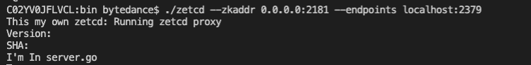

# Rebuild Your Own zetcd

zetcd的build binary似乎对贡献者很不友好。Makefile里的make是build release binary，但我希望把我的更改编译出来，因此我尝试了多种办法希望build current change。最终选择了这个方案： 

## 现在的方案

go get zetcd之后，src里生成github.com/etcd-io/zetcd。修改这里面的代码，并最终打包，生成修改过的二进制文件，终于看到修改的痕迹 "my own zetcd"。修改server.go后也能打印 I'm In server.go。

总结：现在修改的文件的目录需要变为src/github.com/etcd-io/zetcd，在go get下来的源码目录里面改。并且能成功build。