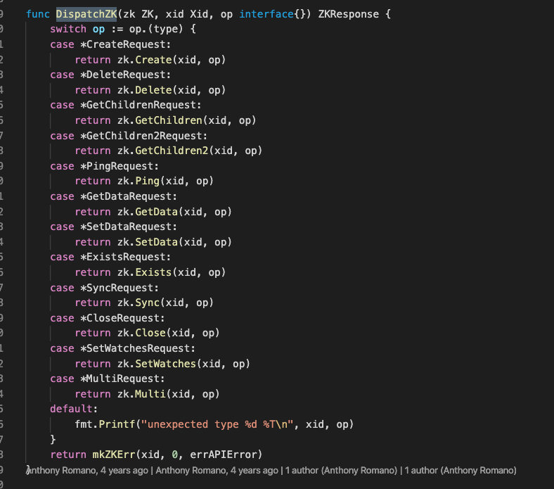
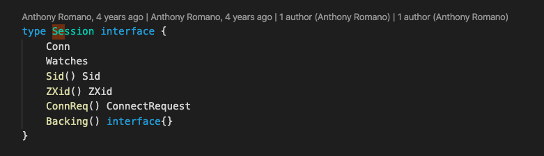
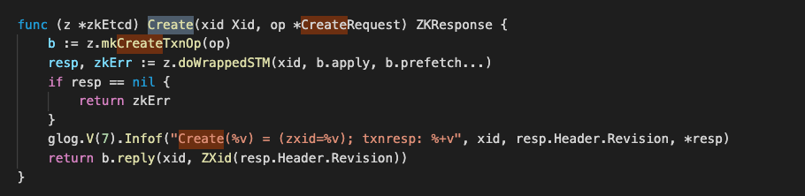

# Zetcd 替换方案 + 思考

本篇主要包含Zetcd源码的一些阅读以及技术上的思考。

## Zetcd 实现

总的来说，还是比较轻量级的项目。核心代码不是特别多，但是缺点就是网上的资料很少。xchk, version, vendor, scripts, docker, integration 等等大部分文件夹可以忽略。zk 似乎是用到zk_bridge的时候才有关，也暂时忽略。

整体项目的入口是cmd/zetcd/zetcd.go。从这里可以看出整体项目的一些设计，主要分成Server，Session, EtcdBackend。

Server负责处理网络请求，主要是形成一个I/O loop, ReadPacket/WritePacket 读取请求并转译。这些请求被转换成Golang结构体后，dispatchRequest到client上。

Session 负责管理连接状态，和zk client的连接，etcd client的连接。

EtcdBackend负责调用etcdv3 api，主要是利用了STM。

如果要添加代码的话，主要是实现一个新的backend支持，也即是用pd的api来实现一些etcd的调用。解析这块可以沿用zetcd的设计，因为这个设计本身就非常符合zk的模型。

那就有新的问题需要解决：

1. pd的API能否支持到etcd的程度？etcd是v3版本的API巨大变革才带来了zetcd，不知道star数比较少的pd能否有足够的能力。
2. 是否是真的必须要用pd，期望性能与实现成本相比是否值得？

对于第二个问题，参考这篇文章：https://coreos.com/blog/introducing-zetcd

可以看到无论是zetcd，etcd，读取效率都是要比原生zk差很多的。这至少证明zetcd在性能方向上是没有优势的，选择它的理由是便利 + 易于部署。所以我们的这种思路，用比较大的成本去换得可能还不如zetcd的性能，是否是值得的呢？