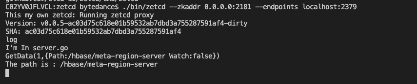

# Meta Region Server 依赖摘除

这篇文章记录了我修改zetcd代码，并成功去掉当请求为/hbase/meta-region-server时对etcd的依赖，并用写死的代码作为返回值。
可以看到client请求/hbase/meta-region-server就是一个非常简单的key value pair，甚至不需要仿造zxid，datResp.Stat等。

## 正常请求
正常来说，zetcd返回GetData请求，需要用到etcd的事务支持。


## 踩的坑

1. 一开始以为GetData只有在HBase Client才会调用，但是发现Hbase Server也严重依赖这个函数，所以我直接修改GetData函数，也影响了Hbase Server，出现了很多奇怪的Bug。现在加入了条件判断，避免误伤其他请求。

2. 希望把返回的Value以字符串的形式打印出来在控制台上，但是发现无论怎么转换都是有乱码，无法正常打印。于是接下来也需要研究Golang的字符串和protobuf看看能否正常打印，否则这个[]byte总是写成一长串数字感觉不太好。


## 最终形式
```go
func (z *zkEtcd) GetData(xid Xid, op *GetDataRequest) ZKResponse {
	p := mkPath(op.Path)
	if op.Path == "/hbase/meta-region-server"{
		fmt.Printf("The path is : %s", op.Path)
		datResp := &GetDataResponse{Data:[]byte{255,0,0,0,20,109,97,115,116,101,114,58,49,54,48,48,48,238,184,44 ,12 ,55 ,147 ,137 ,251 ,80 ,66 ,85 ,70 ,10 ,24 ,10 ,12 ,49 ,48 ,46 ,57 ,49 ,46 ,52 ,52 ,46 ,49 ,50 ,50 ,16 ,148 ,125 ,24,211,141,170,170,182,46,16,0,24,3}} // region server的地址 
		return mkZKResp(xid, 0, datResp)
	}
```

目前来说zketcd的代码改写成了这种形式，直接构造ZKResp并且没有走etcd的查询。
目前对于HBase简单的创建，获取请求，已经能正常响应，并且在op.Path="hbase/meta-region-server"的情况下，没有用到etcd。

HBase正常请求成功：


返回hello world


Zetcd打印正常，按预想的逻辑进行：



## 下一步计划

以下的计划都是可以选的，可以和老师讨论一下先做哪些？

1. ~~学习Protobuf，看能否更好地存meta-region-server地址。~~ 这个[]byte无法解析和Protobuf应该没有关系
2. ~~目前这个值是直接在zetcd写死，看能否用PD来kv读取和存储这个值呢？~~ 是可以存，但是不知道在哪个步骤加入存入PD的操作。因为我在本地Debug的时候没有观察到HBase Server Create 或者 SetData /hbase/meta-region-server，目前原因未知，可能是已经默认配置好了
3. ~~看一下HBase 启动的时候是如何配置/hbase/meta-region-server，用PD来存储，然后GetData再去PD里读，最终把meta-region-server相关的依赖全部摘除.~~ 由于数据库不再是HBase，所以配置方式可能有变化，这里可以等到数据库在zetcd元数据的配置方案确定后再继续。

所以目前稍稍有点迷茫，不知道下一步做啥
