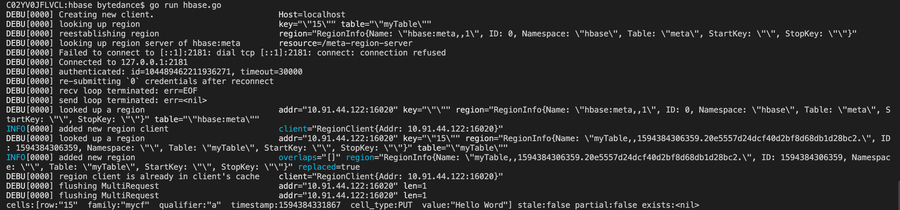
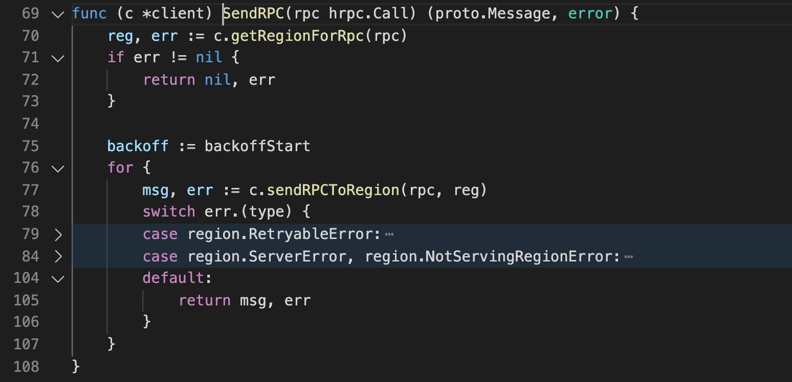
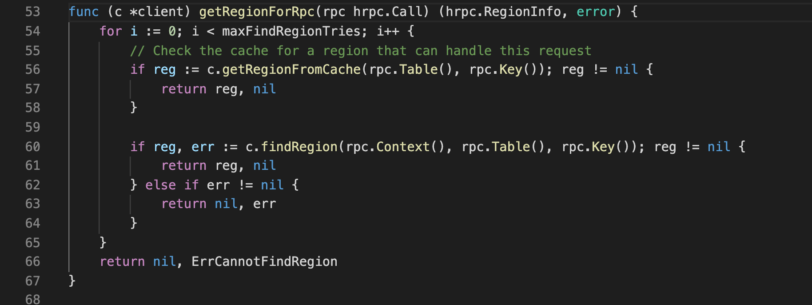
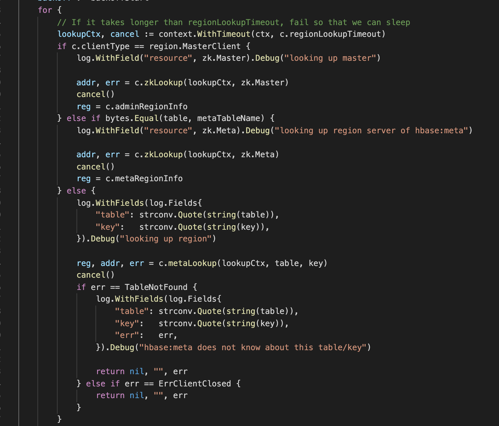

# gohbase Zk 交互源码分析

源码：

(需要先自行进hbase shell建表)

```go
package main


import (
	"context"
	"fmt"
	"os"

	"github.com/sirupsen/logrus"
	"github.com/tsuna/gohbase"
	"github.com/tsuna/gohbase/hrpc"
	// "github.com/tsuna/gohbase/pb"
)

// https://akbarahmed.com/2012/08/13/hbase-command-line-tutorial/

func init() {

	// 以Stdout为输出，代替默认的stderr
	logrus.SetOutput(os.Stdout)
	// 设置日志等级
	logrus.SetLevel(logrus.DebugLevel)
}

func main() {

	client := gohbase.NewClient("localhost")
	// create a table and column family
	// put a scan
	// Values maps a ColumnFamily -> Qualifiers -> Values.
	values := map[string]map[string][]byte{"cf": map[string][]byte{"a": []byte("Hello Word")}}
	putRequest, _ := hrpc.NewPutStr(context.Background(), "table", "15", values)
	client.Put(putRequest)

	// Perform a get for the cell with key "15", column family "cf" and qualifier "a"
	family := map[string][]string{"cf": []string{"a"}}
	getRequest, _ := hrpc.NewGetStr(context.Background(), "table", "15",
		hrpc.Families(family))
	getRsp, _ := client.Get(getRequest)
	fmt.Println(getRsp)
}
```


日志：



从这个源码中可以分析hbase的读写流程：

1. 第一次look up region的时候，region 被封装成要找table名是myTable。
2. 当发现这个请求需要reestablishing region时（意味着要找zk查hbase:meta），第二个请求返回了hbase:meta的Region。这时候会调用zklookup。
3. 调用zklookup会尝试和zk建立连接，2181正好是HBase组件zk的默认端口号。
4. 连接上zk后查询hbase:meta，这时候会返回一个hbase:meat的region client。这个region client代表已经和负责本次I/O的Server连接上了。因为16020正好是负责客户端接入的HBase Region Server端口号。这个region client负责所有client的I/O
5. 用这个region client去发起新的region look up，这时候要找的region info又换成了myTable。这时候会显示added new region，有可能代表新分配了一块region？
6. 不要忘了这是一个Put请求，但是由于现在region client已经在cache里了（table对应的region也已经建立），那么这次Put就会轻松成功(Flushing multiRequest)。
7. 还有一个Flushing MultiRequest代表Get，直接从缓存里拿了结果。


结合一些源码分析一下：

1. 

Put -> mutate -> SendRPC



RPC的过程：先拿Region，然后给Region发RPC。


2. 



拿Region先从缓存查


3. 

终于可以看到与Zk的交互了，可以看到zk负责查谁是Master，hbase:meta在哪里。




4. 深入zkLookup的源码看一下

   


